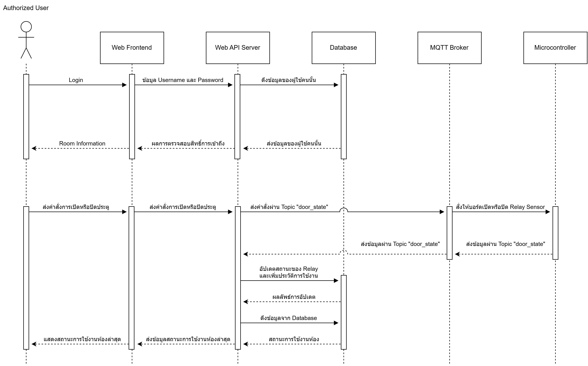
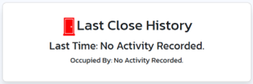

# Boonchai Security System
## Team Members
- 64100738 Kasidit Boonchai
- 64111412 Methanusorn Sutthirat
- 64114069 Setthapong Kiankhao

# Project Structure

## Mosquitto.conf File
This file is used to run the MQTT Broker.

## indoor_esp8266.ino File
Source code to control the microcontroller built-in LED using MQTT.

## Folder: write_rfid
Contains the following file:
- `write_rfid.ino`: Source code to control writing data to RFID cards using a microcontroller.

## Folder: rfid_read
Contains the following file:
- `rfid_read.ino`: Source code to read data from RFID cards using a microcontroller and send it to the MQTT Broker. This code is designed for the ATmega328P+ESP8266 board, which combines two chips for processing.

## Folder: Backend
Contains essential files for the Web API Server, Database (JSON Server), and Web Frontend module. The Web Frontend module is stored in the `templates` folder.

# Project Demo
To view a demo of the project, check out the YouTube video [here](https://youtu.be/ImKdBB_0DGw?si=FHAnJP-pQUcLjYLM)


# ระบบ Boonchai Security
## บทนำ
  "Indoor Security" เป็น Domain ที่ให้ความสำคัญอย่างมากด้านความปลอดภัยของสถานที่ภายในอาคาร เช่น บ้าน, อาคาร, ห้องสำนักงาน, หรือสถานที่อื่น ๆ ที่ต้องการการควบคุมและป้องกันการเข้าถึงที่ไม่ได้รับอนุญาตหรือภัยคุกคามต่าง ๆ จากภายนอก ซึ่งเป็นหนึ่งในปัจจัยที่สำคัญในการรักษาความปลอดภัยของบุคคล, ทรัพย์สิน, และข้อมูลสำคัญ
  
  ในการสร้างระบบป้องกันความปลอดภัยของห้องสำนักงานที่มีความลับขั้นสูงหรือโกดังสินค้าที่ให้สิทธิ์ในการเข้าถึงเฉพาะผู้ที่ได้รับอนุญาตเท่านั้น มักจะเป็นปัญหาที่ท้าทายที่ต้องมีการจัดการอย่างระมัดระวัง.ทั้งเรื่องของความซับซ้อนในการบริหารจัดการสิทธิ์และการเข้าถึง, รวมถึงความจำเป็นต้องรักษาความปลอดภัยของข้อมูลหรือสินค้าที่เป็นความลับ ซึ่งปัญหาที่อาจเกิดขึ้นรวมถึงการเผชิญกับความเสี่ยงจากบุคคลที่ไม่มีสิทธิ์ในการเข้าถึง, ความซับซ้อนในการบริหารจัดการระบบ, และการรวบรวมข้อมูลการเข้าถึงโดยบุคคลที่ได้รับอนุญาต. การที่ระบบมีความปลอดภัยไม่เพียงพออาจส่งผลให้มีช่องโหว่ที่อาจทำให้ข้อมูลหรือสินค้าที่มีความลับถูกเข้าถึงโดยบุคคลที่ไม่ได้รับอนุญาต ซึ่งจำนำไปสู่ความเสี่ยงทางด้านความปลอดภัยและการสูญหายของข้อมูลหรือสินค้า

  การป้องกันความปลอดภัยภายในอาคารมีความซับซ้อนและท้าทายมากสำหรับผู้พัฒนาระบบรักษาความปลอดภัย เพื่อแก้ไขปัญหานี้การนำเทคโนโลยี IoT เข้ามาเป็นส่วนหนึ่งของระบบรักษาความปลอดภัยนั้นสามารถลดความซับซ้อนและเพิ่มประสิทธิภาพในการรักษาความปลอดภัยได้

  ในการพัฒนาระบบรักษาความปลอดภัยนี้มีจุดประสงค์เพื่อ ควบคุมและติดตามการเข้าถึงข้อมูลหรือสินค้าให้เข้าถึงได้เฉพาะบุคคลที่ได้รับอนุญาตเท่านั้น ซึ่งจะมีการบันทึกข้อมูลการเข้าใช้งานห้องหรือโกดังสินค้าผ่านบัตรที่รองรับ RFID หรือกรณีที่ผู้ใช้ลืมพกบัตรหรือทำบัตรหายก็สามารถเข้าถึงข้อมูลหรือสินค้าได้ โดยการลงชื่อเข้าใช้ผ่านเว็บไซต์

## การออกแบบระบบ
  - สถาปัตยกรรมระบบ
    
    จากสถาปัตยกรรมระบบนี้ เป็นสถาปัตยกรรมของระบบ Boonchai Security ที่แบ่งเป็น 3 โมดูลดังนี้

    โมดูลที่ 1 คือ Microcontroller & Sensor เป็นโมดูลที่เกี่ยวข้องกับอุปกรณ์ด้าน Hardware ต่าง ๆ โดยส่วนของ Arduino นั้นจะทำหน้าที่ในการควบคุมการเปิดและปิด Relay Sensor โดยผู้ใช้จะต้องยืนยันตัวตนผ่านบัตร RFID ผ่าน RFID Sensor ซึ่งจะใช้ LED RGB 140C05 แสดงผลในบริบทการใช้งานต่าง ๆ และส่วนของ ESP8266 NodeMCU จะเป็นบอร์ดที่ใช้เพื่อควบคุมการเปิดหรือปิดไฟในบอร์ดที่สื่อถึงการเปิดหรือปิดไฟในห้อง

    โมดูลที่ 2 คือ Backend เป็นโมดูลที่ทำหน้าที่เป็นศูนย์กลางการรับส่งข้อมูลระหว่างโมดูลต่าง ๆ โดยประกอบไปด้วย MQTT Broker ซึ่งทำหน้าที่ในการรับส่งข้อมูลจาก API Server และโมดูล Microcontroller 
API Server ทำหน้าที่เป็นตัวติดต่อระหว่าง Database และโมดูล Frontend อีกทั้งยังมีการส่งข้อมูลกลับไปยัง Microcontroller ผ่าน MQTT Broker เพื่อใช้ในการควบคุม Sensor ต่าง ๆ และส่วนของ Database ใช้สำหรับเก็บข้อมูลต่าง ๆ ในรูปแบบของ JSON

    โมดูลที่ 3 คือ Frontend เป็นโมดูลที่เกี่ยวข้องกับการแสดงผลข้อมูล สถานะต่าง ๆ และสามารถควบคุมการเปิดและปิดประตูผ่านเว็บไซต์ด้วยการ Login โดยจะมีการแบ่งสิทธิ์การเข้าถึง

  - สถาปัตยกรรมซอฟต์แวร์ (Module สำหรับการใช้งานผ่าน Web Frontend)
    
    Module สำหรับการใช้งานผ่าน Web Frontend เป็นระบบควบคุมการเปิด-ปิดประตูห้อง โดยผู้ใช้จะต้อง Login เข้าสู่ระบบก่อน จากนั้นระบบจะตรวจสอบสิทธิ์การเข้าถึงของผู้ใช้ หากผู้ใช้มีสิทธิ์เข้าใช้งานห้อง Web API Server จะส่งคำสั่งการเปิดหรือปิดประตูผ่าน MQTT Broker ไปยัง Microcontroller ซึ่งจะควบคุม Relay Sensor ให้ทำงานเพื่อเปิดหรือปิดประตูตามคำสั่งที่ได้รับ จากนั้นระบบจะอัปเดตสถานะของ Relay และประวัติการเข้าใช้งานห้องลงใน Database และแสดงสถานะการใช้งานห้องประชุมล่าสุดให้กับผู้ใช้ผ่าน Web Frontend โดย Module นี้ประกอบด้วย 6 องค์ประกอบหลัก ได้แก่
    - Authorized User: ผู้ใช้ที่ได้รับสิทธิ์เข้าใช้งานห้อง
    - Web Frontend : หน้าเว็บไซต์สำหรับติดต่อกับผู้ใช้
    -	Web API Server : บริการ API สำหรับองค์ประกอบต่าง ๆ
    -	Database : ฐานข้อมูลสำหรับเก็บข้อมูลเกี่ยวกับสถานะของ Relay และประวัติการไปใช้งานห้อง
    -	MQTT Broker : ตัวกลางสำหรับรับส่งข้อมูลระหว่าง Web API Server และ Microcontroller 
    -	Microcontroller: หน่วยควบคุมสำหรับควบคุมการทำงานของ Relay และ LED RGB 140C05
      
  - สถาปัตยกรรมซอฟต์แวร์ (Module สำหรับการใช้งานผ่านบัตร RFID)
    
    Module สำหรับการใช้งานผ่านบัตร RFID เป็นระบบควบคุมการเปิด-ปิดประตูห้อง โดยผู้ใช้จะต้องสแกนบัตร RFID เพื่อระบุตัวตนก่อน จากนั้น Web API Server จะตรวจสอบสิทธิ์การเข้าถึงของผู้ใช้ หากผู้ใช้มีสิทธิ์เข้าถึงห้อง ระบบจะส่งคำสั่งการเปิดหรือปิดประตูผ่าน MQTT Broker ไปยัง Microcontroller ซึ่งจะสั่งให้ Relay Sensor ทำงานเพื่อเปิดหรือปิดประตูตามคำสั่งที่ได้รับ จากนั้นระบบจะอัปเดตสถานะของ Relay และประวัติการใช้งานห้องลงใน Database และแสดงสถานะการใช้งานห้องประชุมล่าสุดให้กับผู้ใช้ โดย Module นี้ประกอบไปด้วย 5 องค์ประกอบหลัก ได้แก่
    -	Authorized User : ผู้ใช้ที่ได้รับสิทธิ์เข้าถึงห้อง
    -	Microcontroller : หน่วยควบคุมสำหรับควบคุมการทำงานของ Relay และ LED RGB 140C05
    -	Web API Server : บริการ API สำหรับส่งคำสั่งการเปิด-ปิดประตู 
    -	Database : ฐานข้อมูลสำหรับเก็บข้อมูลเกี่ยวกับสถานะของ Relay และประวัติการไปใช้งานห้อง
    -	MQTT Broker : ตัวกลางสำหรับรับส่งข้อมูลระหว่าง Web API Server และ Microcontroller
   
      ซึ่งทั้ง 2 Module นี้สามารถนำไปประยุกต์ใช้กับระบบควบคุมการเปิด-ปิดประตูอื่นๆ ได้อย่างหลากหลาย เช่น ระบบควบคุมการเปิด-ปิดประตูบ้าน ระบบควบคุมการเปิด-ปิดประตูโรงงาน เป็นต้น
  -โครงสร้างข้อมูล
    ```
      {
        "room_status": {
          "id": 1,
          "status": "Unoccupied",
          "occupied_by": "N/A"
        },
        "users": [
          {
            "id": 1,
            "uid": "64111111",
            "password": "12345",
            "fname": "John",
            "lname": "Doe",
            "authorize": true
          }
        ],
        "log": [
          {
            "id": 1,
            "open": "14-12-2023, 16:07:02",
            "close": "14-12-2023, 16:07:06",
            "opened_by": "64111111",
            "closed_by": "64222222"
          }
        ]
      }

    ```

  - Data Dictionary

    | Field        | Data Type | Constraint    | Description                                |
    |--------------|-----------|---------------|--------------------------------------------|
    | id           | int       | Primary key   | Auto generated                             |
    | uid          | text      | Not null      | Client id                                  |
    | password     | text      | Not null      | Login password for client                   |
    | fname        | text      | Not null      | First Name                                 |
    | lname        | text      | Not null      | Last Name                                  |
    | authorize    | Boolean   | Not null      | Condition                                  |
    | open         | text      | Not null      | Time to open the door                       |
    | close        | text      | Not null      | Time to close the door                      |
    | opened_by    | text      | Not null      | UID from client who opened the door         |
    | closed_by    | text      | Not null      | UID from client who closed the door         |
    | status       | text      | Not null      | Indicates the status of the door is in use  |
    | occupied_by  | text      | Not null      | Indicates who is using the door             |

  - การพัฒนาระบบ <br>
      - Microcontroller & Sensor Module <br>
          - เครื่องมือ 
            -	ESP8266 atmega328p ESP8266 + 8mb flash usb-ttl ch340G ใช้ในการควบคุมการทำงานของ           Relay และ LED RGB 140C05
            -	Relay 2 Channel ใช้ในการเปิดปิดประตู
            -	LED RGB 140C05 ใช้ในการบ่งบอกสถานะการใช้ประตู
            -	RFID Reader Module RC522 ใช้ร่วมกับการ์ดเพื่อสแกนเปิดปิดประตู
            -	NodeMCU ESP8266 ใช้ในการควบคุมไฟ LED RGB 140C05
              ภาษาโปรแกรม
            -	C language ในการพัฒนา board และ Sensors 
      - Backend Module
       	  - เครื่องมือ
            -	Python: Flask, requests, paho-mqtt, เป็น framework สำหรับทำ Web API Server
            -	Javascript: Node.JS, JSON Server สำหรับเก็บข้อมูลบน Database
      -	Frontend Module
        - เครื่องมือ
          -	HTML ใช้ในการพัฒนาโครงสร้างเว็บไซต์
          -	JavaScript, jQuery ควบคุมการประมวลผลของเว็บไซต์
          -	CSS ใช้ในการตกแต่งเว็บไซต์
        -	เฟรมเวิร์ค
            -	Bootstrap เป็นเฟรมเวิร์คสำเร็จรูปใช้ในการตกแต่งเว็บไซต์
## การทดสอบ
  - Test Case #1
      ทดสอบการควบคุม Relay ผ่านบัตร RFID
      
      ภาพของ Relay ในสถานะปกติ (ปิดประตู)
    
      
      ภาพผลลัพธ์หลังจากแตะบัตร RFID เพื่อปิด Relay (เปิดประตู)
      
    
  - Test Case #2
      ทดสอบการแสดงผลของ Mixed RGB ตามบริบทการใช้งานต่าง ๆ ดังนี้
      หากระบบกำลังเชื่อมต่อเครือข่ายจะมีไฟแสดงผลเป็นไฟสีขาว
    
    ภาพผลลัพธ์การแสดงผลของ Mixed RGB ซึ่งอยู่ในสถานะกำลังเชื่อมต่อเครือข่าย และยังไม่พร้อมใช้งาน
    
    หากระบบเชื่อมต่อเครือข่ายสำเร็จจะมีไฟแสดงผลเป็นไฟสีฟ้า ซึ่งเป็นสถานะพร้อมใช้งาน
        
    ภาพผลลัพธ์การแสดงผลของ Mixed RGB ซึ่งเชื่อมต่อเครือข่ายสำเร็จแล้ว และอยู่ในสถานะพร้อมใช้งาน
    
    หากเจ้าของบัตร RFID ไม่มีสิทธิ์เข้าใช้งานห้องจะมีไฟสีแดงกระพริบ 3 ครั้ง
    
    ภาพผลลัพธ์การแสดงผลของ Mixed RGB ในกรณีที่มีผู้ที่ไม่ได้รับอนุญาตมาแตะบัตร RFID เพื่อควบคุม Relay สำหรับเปิดหรือปิดประตู

    หากเจ้าของบัตร RFID มีสิทธิ์ใช้งานห้องจะมีไฟสีเขียวกระพริบ 1 ครั้ง
    
    ภาพผลลัพธ์การแสดงผลของ Mixed RGB ในกรณีที่มีผู้ที่ได้รับอนุญาตมา
แตะบัตร RFID เพื่อควบคุม Relay สำหรับเปิดหรือปิดประตู
  -	Test Case #3
    ทดสอบระบบ Login และ Logout ผ่าน Web Frontend
   	
    ภาพก่อนผู้ใช้งานจะ Login

    
    ภาพผลลัพธ์หลังจากผู้ใช้งานเข้าสู่ระบบสำเร็จ

    
    ภาพผลลัพธ์ในกรณีที่ผู้ใช้งานไม่มีสิทธิ์เข้าถึงระบบ หรือกรณีที่มีการกรอกข้อมูล Username Password ผิด
  -	Test Case #4
  	ทดสอบการสั่งงานเปิดหรือปิด Relay ผ่าน Web Frontend ซึ่งมีเงื่อนไขในการใช้งานดังนี้
    การส่งคำสั่งในขณะที่ไม่มีผู้ใช้งานห้องอยู่
   	
    ภาพผลลัพธ์การแสดงผลในหน้า Home ก่อนจะสั่งเปิดหรือปิด Relay 
    ซึ่งผู้พัฒนาจะเข้าสู้ระบบโดยใช้ User ID 64111111
   	
    ภาพผลลัพธ์การแสดงผลในหน้า Home หลังจากสั่งปิด Relay (เปิดประตู)
    
    ภาพผลลัพธ์การแสดงผลในหน้า Home หลังจากสั่งเปิด Relay (ปิดประตู)

    หากเจ้าของบัตร RFID กำลังเปิดใช้งานห้องอยู่ ผู้ใช้งาน ID อื่นจะไม่สามารถสั่งปิด Relay ผ่าน Web Frontend ได้ เช่น หากผู้ใช้งานรหัส A ได้แตะบัตร RFID เพื่อควบคุม Relay ผู้ใช้งานรหัส B จะไม่สามารถส่งคำสั่งเพื่อควบคุม Relay ผ่าน Web Frontend ได้ เป็นต้น
   	
    ภาพผลลัพธ์การแสดงผลในหน้า Home กรณีที่มีผู้ที่กำลังใช้งานห้องอยู่ 
ซึ่งในการทดสอบนี้ผู้พัฒนาจะเข้าสู่ระบบโดยใช้ User ID 64111111
    
    ภาพผลลัพธ์การแสดงผลในหน้า Home กรณีที่สั่งเปิด Relay (ปิดประตู) โดย User ID 64111111

    หาก Relay อยู่ในสถานะปิดหรือเปิดอยู่ ผู้ใช้งานจะไม่สามารถสั่งปิดหรือเปิดซ้ำผ่าน Web Frontend ได้
   	
    ภาพผลลัพธ์การแสดงผลในหน้า Home กรณีที่ประตูปิดอยู่และผู้ใช้สั่งปิดประตู
   	
    ภาพผลลัพธ์การแสดงผลในหน้า Home กรณีที่ประตูเปิดอยู่และผู้ใช้สั่งเปิดประตู
  - Test Case #5
    ทดสอบการแสดงผลสถานะการใช้งานห้องผ่าน Web Frontend
    
    ภาพผลลัพธ์การแสดงผลในหน้า Home ในกรณีที่ยังไม่มีผู้ใช้งานห้อง ณ ขณะนั้น 
    ซึ่งจะแสดงสถานะเป็น Unoccupied และไม่แสดง ID ของผู้ที่กำลังใช้งาน (N/A)
    
    ภาพผลลัพธ์การแสดงผลในหน้า Home ในกรณีที่มีผู้กำลังใช้งานห้องอยู่ 
    ซึ่งจะแสดงสถานะเป็น Occupied และแสดง ID ของผู้ที่กำลังใช้งานห้องอยู่ ณ ขณะนั้น
  - Test Case #5
    ทดสอบการแสดงผลประวัติการเข้าใช้งานห้องผ่าน Web Frontend
    
    
    ภาพผลลัพธ์การแสดงผลในหน้า Home ในกรณีที่ไม่พบประวัติ ผู้ที่เข้าใช้งานห้องล่าสุด
    
    
    ภาพผลลัพธ์การแสดงผลในหน้า Home ซึ่งจะแสดงรายละเอียดต่าง ๆ เกี่ยวกับผู้ที่เข้าใช้งานห้องล่าสุด
    
    ภาพผลลัพธ์การแสดงผลในหน้า Tables ในกรณีที่ไม่พบข้อมูลประวัติการใช้งานห้อง
    
    ภาพผลลัพธ์การแสดงผลในหน้า Tables ในกรณีที่พบข้อมูลประวัติการใช้งานห้อง ซึ่งจะแสดงรายละเอียดต่าง ๆ      เช่น วันและเวลาที่เปิดหรือปิดประตู และประตูเปิดหรือปิดโดยผู้ใช้ ID ใด
## สรุปผลการทดสอบ
  โครงการนี้สามารถแก้ไขปัญหาที่ได้กล่าวไปในวัตถุประสงค์ ในเรื่องของการรักษาความปลอดภัย และสามารถบันทึกข้อมูลการเข้าใช้งานห้องหรือโกดังสินค้าผ่านบัตรที่รองรับ RFID หรือกรณีที่ผู้ใช้ลืมพกบัตรหรือทำบัตรหายก็สามารถเข้าถึงข้อมูลหรือสินค้าได้ โดยการลงชื่อเข้าใช้ปละควบคุมการทำงานผ่านเว็บไซต์
